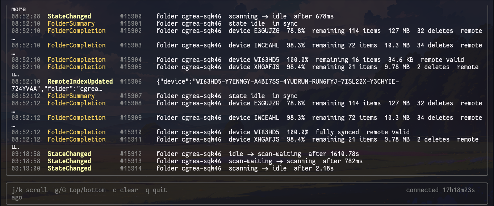

# BeautyThing

BeautyThing is a terminal UI for consuming Syncthing activity in realtime.

It connects to Syncthing's REST event endpoint, long-polls for new events,
and renders a live activity feed with readable summaries instead of raw event
payloads.

## Features

- Alternate-screen TUI with a live event feed
- Realtime event streaming from `/rest/events` or `/rest/events/disk`
- API key authentication via flag or environment variable
- Human-readable summaries for common Syncthing events
- Scrollable history with keyboard navigation
- Gap detection when event IDs jump
- Graceful shutdown on `Ctrl+C`

## Screenshot



## Run

```bash
go run ./cmd/beautything \
  -url http://127.0.0.1:8384 \
  -api-key "$SYNCTHING_API_KEY"
```

You can also use environment variables:

```bash
export SYNCTHING_URL=http://127.0.0.1:8384
export SYNCTHING_API_KEY=your-api-key
go run ./cmd/beautything
```

## Useful flags

```text
-api-key string
      Syncthing API key (or use SYNCTHING_API_KEY)
-disk-only
      use /rest/events/disk for LocalChangeDetected and RemoteChangeDetected only
-events string
      comma-separated event type filter for /rest/events
-insecure
      skip TLS verification for HTTPS Syncthing endpoints
-no-color
      disable ANSI colors
-since int
      start after this event ID (default -1 means resume from latest)
-timeout duration
      long-poll timeout per request (default 55s)
-url string
      Syncthing base URL (or use SYNCTHING_URL) (default "http://127.0.0.1:8384")
```

## Examples

Launch the TUI:

```bash
go run ./cmd/beautything -api-key "$SYNCTHING_API_KEY"
```

Watch only item-level transfer events:

```bash
go run ./cmd/beautything \
  -api-key "$SYNCTHING_API_KEY" \
  -events ItemStarted,ItemFinished,FolderSummary
```

Watch filesystem change events:

```bash
go run ./cmd/beautything \
  -api-key "$SYNCTHING_API_KEY" \
  -disk-only
```

## Controls

```text
j / k      scroll
g / G      jump to top / bottom
c          clear the feed
q          quit
Ctrl+C     quit
```

BeautyThing uses the official Syncthing REST event API:

- `GET /rest/events`
- `GET /rest/events/disk`

Syncthing requires an API key for the REST API. Set it in the `X-API-Key`
header or as a bearer token.
